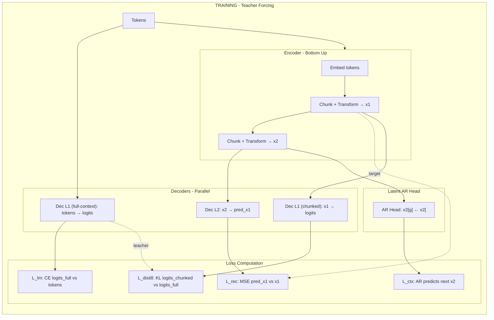
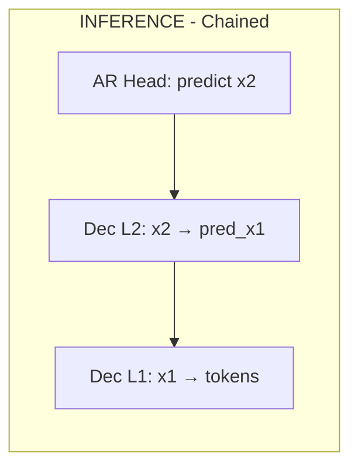

# PHOTON: Hierarchical Latent Language Model

Implementation of PHOTON (Parallel Hierarchical Operation for TOp-down Networks) based on [Ichikawa et al. 2025](https://arxiv.org/abs/2501.xxxxx).

## Architecture

PHOTON replaces flat token-by-token scanning with vertical, multi-resolution context access:

- **Bottom-up encoder**: Compresses tokens → L1 latents → L2 latents
- **Top-down decoder**: Reconstructs L2 → L1 → tokens through lightweight local decoders
- **Bounded attention**: Each chunk processes independently (no global KV cache growth)

### Training (Teacher Forcing)

During training, decoders operate in parallel using encoder outputs:



### Inference (Chained Top-Down)

During inference, decoders chain together—no re-encoding needed:



## Quick Start

### Installation

```bash
pip install -r requirements.txt
```

### Training

```bash
# PHOTON (2×T4 GPUs with DeepSpeed ZeRO-3)
accelerate launch --num_processes 2 train_accel_zero3.py
# Defaults aim for the paper’s total batch ≈256: batch_size=3 per process, grad_accum=43 on 2 processes (~258 effective); AdamW lr 3e-4 with 3k warmup (see ds/zero3_fp16.json). Adjust grad_accum if num_processes changes.

# Baseline transformer for comparison
accelerate launch --num_processes 2 train_baseline_zero3.py
```

### Generation

```bash
python test_generate.py --checkpoint checkpoints_photon/checkpoint_5000.pt --prompt "Once upon a time"
```

## Project Structure

```
Photon/
├── photon/
│   ├── config.py      # PhotonConfig dataclass
│   ├── model.py       # PhotonLM, encoders, decoders, converters
│   ├── data.py        # Dataset loading and collation
│   └── inference.py   # Top-down generation
├── baseline/
│   └── model.py       # Vanilla transformer for comparison
├── train_accel_zero3.py      # PHOTON training script
├── train_baseline_zero3.py   # Baseline training script
├── test_generate.py          # Text generation script
└── ds/
    └── zero3_fp16.json       # DeepSpeed config
```

## Key Hyperparameters (defaults = PHOTON-600M, Table 6)

| Parameter | Default | Description |
|-----------|---------|-------------|
| `C1` | 4 | Tokens per L1 latent |
| `C2` | 4 | L1 latents per L2 latent |
| `d_embed_enc` | 416 | Token embedding dim (encoder) |
| `d_latent` | 1664 | Latent dim (4× `d_embed_enc`) |
| `n_heads` | 32 | Attention heads (d_head=52) |
| `d_ff` | 4096 | FFN hidden dim |
| `lambda_lm` | 1.0 | LM loss weight |
| `lambda_ctx` | 0.0 | Next-context loss (AR head off by default) |
| `lambda_rec` | 1.0 | Reconstruction loss weight |

## References

- [PHOTON Paper](https://arxiv.org/abs/2501.xxxxx) - Ichikawa et al. 2025
- [Block Transformer](https://arxiv.org/abs/2401.02234) - Related hierarchical approach
